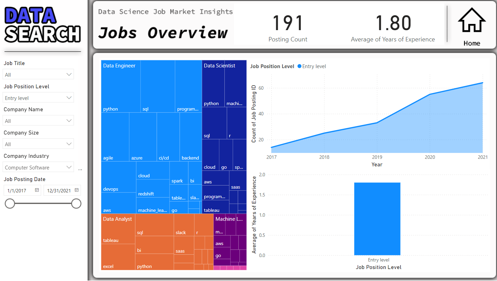

# Job Posting Analysis for DataSearch

## Project Overview
This Power BI case study involves exploring a real-world job posting dataset to uncover insights for a fictional recruitment company called DataSearch. The primary goal is to analyze the data to determine the most in-demand skills for data scientists, data analysts, and data engineers. The project involves using Power Query for data cleaning, DAX for building visualizations, and Power BI for creating a comprehensive business dashboard.

## Table of Contents
- [Introduction](#introduction)
- [Dataset](#dataset)
- [Data Cleaning](#data-cleaning)
- [Data Analysis](#data-analysis)
- [Visualizations](#visualizations)
- [Dashboard](#dashboard)
- [Conclusion](#conclusion)
- [How to Use](#how-to-use)
- [Acknowledgements](#acknowledgements)

## Introduction
DataSearch is a recruitment company focused on sourcing top talent in the data science field. By analyzing job postings, we aim to provide insights into the skills most sought after by employers. This information will help DataSearch better align their recruitment strategies with market demand.

## Dataset
The dataset used in this project contains job postings for various data-related positions. The key attributes in the dataset include:
- Job Title
- Company
- Location
- Required Skills
- Job Description
- Posted Date

## Data Cleaning
The initial step in this project was to clean the data using Power Query. The cleaning process included:
- Removing duplicate entries
- Standardizing the format of job titles and skills
- Handling missing values
- Filtering out irrelevant job postings

## Data Analysis
Once the data was cleaned, we used DAX (Data Analysis Expressions) to perform various analyses, including:
- Identifying the most frequently mentioned skills for each job role
- Analyzing the distribution of job postings across different locations
- Determining the trend of job postings over time

## Visualizations
Using DAX, we created several visualizations to highlight our findings:
- Bar charts to show the top skills for data scientists, data analysts, and data engineers
- Heat maps to illustrate the geographical distribution of job postings
- Line graphs to depict the trend of job postings over time

## Dashboard
The final step was to create a comprehensive business dashboard in Power BI. The dashboard includes:
- An overview of the total number of job postings
- Detailed visualizations of the top skills for each job role
- Insights into the geographical distribution of job postings
- Trend analysis of job postings over time

[text](README.md)    

## Conclusion
The analysis provided valuable insights into the skills most in-demand for data-related positions. These insights will help DataSearch optimize their recruitment process and better serve their clients.

## How to Use
1. **Open the Power BI file**: Download and open the provided Power BI file to explore the dashboard.
2. **Interact with the dashboard**: Use the interactive features to filter and drill down into specific insights.
3. **Customize as needed**: Modify the data sources, visualizations, and DAX formulas to fit your specific needs.

## Acknowledgements
This project was completed as part of a Power BI case study, leveraging the skills and knowledge gained from various Power BI courses. Special thanks to DataCamp for providing the training and resources necessary to undertake this project.
